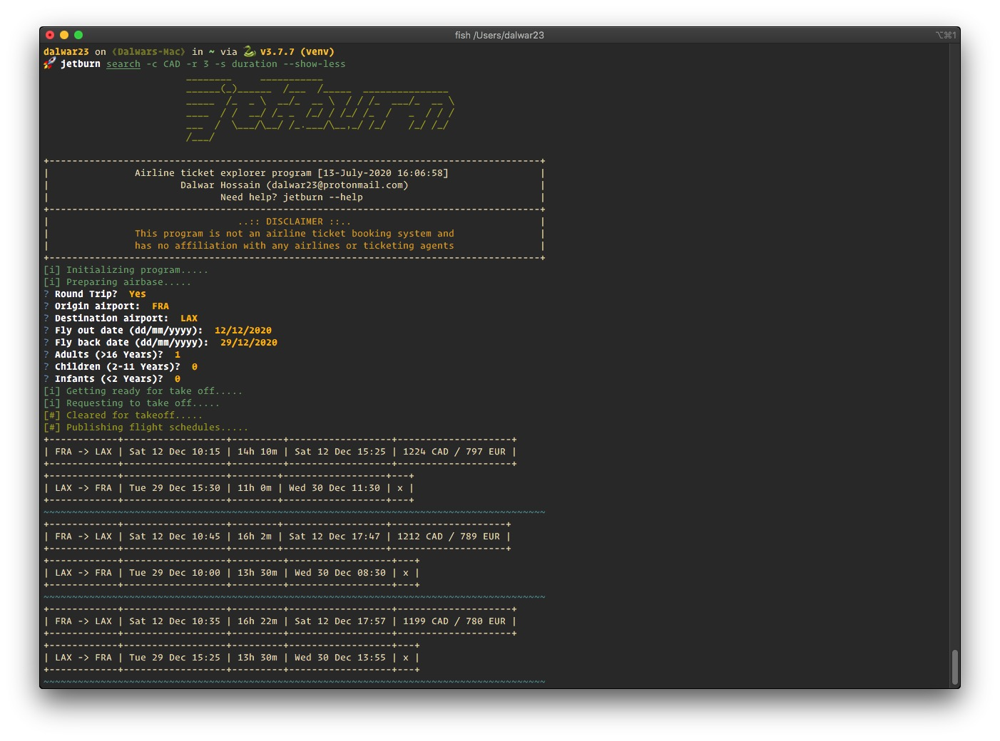

Tutorials
=========

Usage
-----

.. note::

   Always remember, when in doubt use ``--help`` flag.

Getting Help
--------------

.. code-block:: shell

   jetburn --help

Search
------

Options
^^^^^^^

``search`` is the option that does the actual flight seaches. It has
quite a few options to consider. ``--help`` flag will show all available
options.

.. code-block:: shell

   jetburn search --help

Simple Search
^^^^^^^^^^^^^

To search for flights between two airports, invoke a simple search with

.. code-block:: shell

   jetburn search

Display Less Information
^^^^^^^^^^^^^^^^^^^^^^^^

To show less information on screen use ``--show-less`` flag.

.. code-block:: shell

   jetburn search --show-less

Use Previous Search Parameters
^^^^^^^^^^^^^^^^^^^^^^^^^^^^^^

To use the previous search parametes again in a new search, pass in the
``-p`` or ``--use-prev`` flag. In this way, system will not ask question
about your trip details. It will try to find the previous search parameters
and use it, in case the system can't find any previous search it will prompt
for trip details.

.. code-block:: shell

   jetburn search -p --show-less

Price in Desired Currency
^^^^^^^^^^^^^^^^^^^^^^^^^

To get the ticket price in a desired currency, add ``-c`` or ``--currency`` flag
follwed by ``ISO 4217`` currency code. 

.. hint::
   
   See ``FIND`` section of this tutorial to find the currency code of your
   desired country.

.. code-block:: shell

   jetburn search -c AUD --show-less

Adjust Search Results Display
^^^^^^^^^^^^^^^^^^^^^^^^^^^^^

By default the system will show ``5`` results on screen. With the help of
``-r`` or ``--rows`` flag this behaviour can be adjusted between ``1 - 25``.
Below example shows only ``2`` results.

.. code-block:: shell

   jetburn search -c AUD -r 2 -p --show-less

Sort Search Results
^^^^^^^^^^^^^^^^^^^

Search results can be sorted against ``price`` and ``duration``. By ``DEFAULT``
it's sorted from ``LOWEST`` **PRICE** ``HIGHEST``.

There are two options available for sorting - ``price`` and ``duration`` of the
flight. To sort the results according to flight duration use ``-s`` or ``--sort``
flag. The following example shows a result set sorted by ``duration``.

.. code-block:: shell

   jetburn search -c CAD -r 3 -s duration --show-less

Info
----

To get the current version use -

.. code-block:: shell

   jetburn --version

If interested in more information about the package use ``info`` 
sub-command

.. code-block:: shell

   jetburn info

Find
----

Aritports
^^^^^^^^^

To find ``airports`` by city name use ``find`` sub-command. E.g. 
let's find out all airports located in/near ``LONDON``.

.. code-block:: shell

   jetburn find --airport london

Airlines
^^^^^^^^

Finding ``IATA`` code for airlines from a search is easy but this
option is designed to help to get the name of the airline. e.g Let's find
out which airline is ``VA`` or ``0b`` ?

.. code-block:: shell

   jetburn find --airline va

Currency
^^^^^^^^

If you are in doubt what is the currency code to be used while searching,
currency codes can be obtained through ``--currency`` flag with
``country name`` as an argument. e.g. Let's take a look at the currency
code of ``mongolia``

.. code-block:: shell

   jetburn find --currency mongolia

Check
-----

This sub-command is designed to check if a currency can be used to
search flights. Flight search will show results in provided currency if
the provided currency is a valid currency. Let's check if ``ALL`` is a
valid currency or not.

.. Important::

    ``all`` in small letters will show all the valid currencies but ``ALL`` is
    a valid currency of ``ALBANIA``

.. code-block:: shell

   jetburn check --currency ALL

